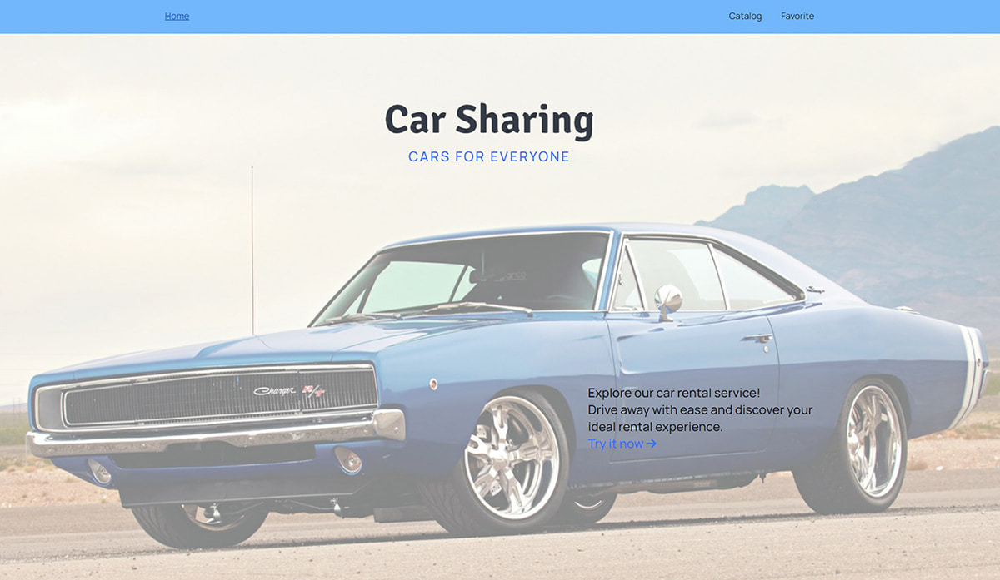
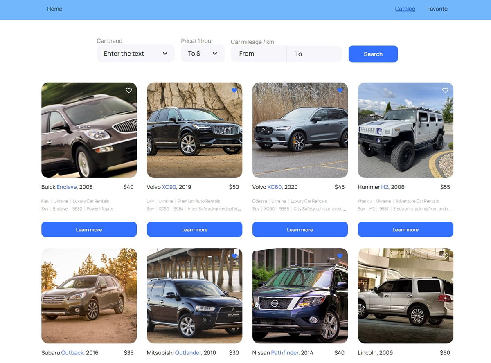
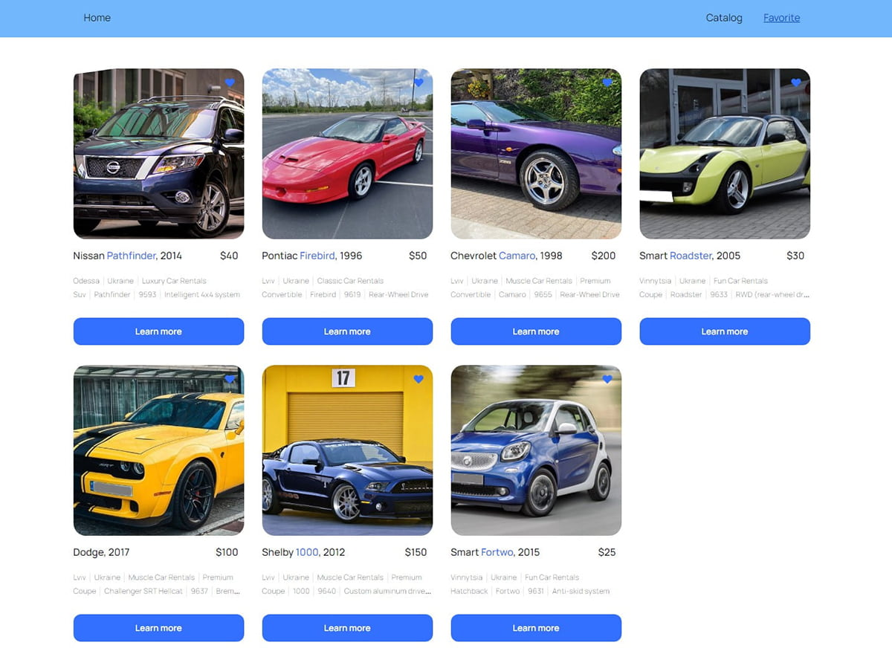

# CarSharing app

This application is intended for a company that provides car rental services in Ukraine.

[Features](#features)  
[Technologies](#technologies)  
[Quick Start (Installation)](#installation)  

<a name="features"></a>
## Features

The application consists of 3 pages:



- Home page with a general description of services provided by the company;



- a page containing a catalog of cars of various configurations (Catalog Page), which the user can filter by brand, price per hour of car rental and the number of kilometers covered by the car during its operation (mileage);



- Favorites Page with ads that have been added to favorites by the user.


<a name="technologies"></a>
## Technologies 

This app is created using the following technologies:
HTML, CSS, JavaScript, React, Redux Toolkit, Axios.


<a name="installation"></a>
## Quick Start (Installation) 

To get started with this React application, follow these steps:

Clone this repository to your local machine using the following command:

```bash
git clone https://github.com/OlgaGresko/CarSharing.git
```

Navigate into the project directory:
```bash
cd your-repository
```

Install the required dependencies using npm or Yarn:

```bash
npm install
```

After installing the dependencies, start the development server:

```bash
npm run dev
```

Open [http://localhost:5174](http://localhost:5174) in your web browser to view the application. The page will reload if you make edits and you'll also see any lint errors in the console.

Feel free to customize this installation guide based on your application's specific requirements or any additional steps users might need to follow to run your React application successfully.

=======================================================

Developer - [Olga Gresko](https://github.com/OlgaGresko)

